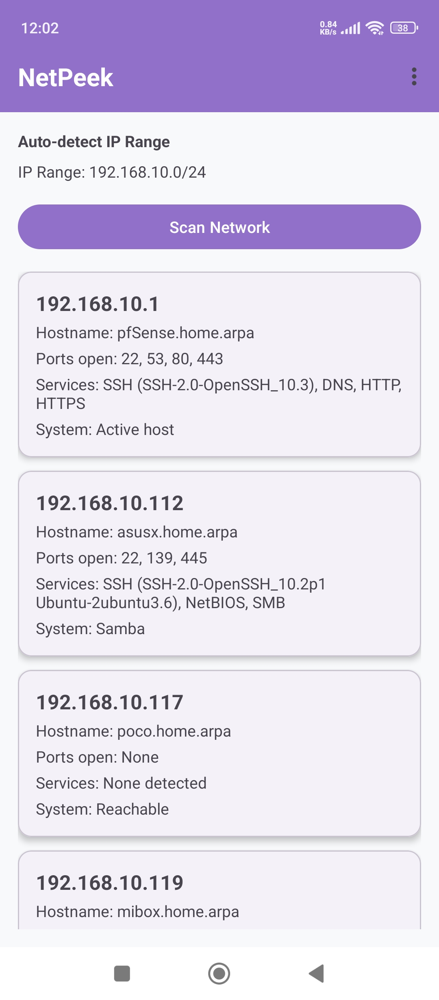

Modern Android network scanner written in Kotlin.

Discover devices on your local network.

## Features

    Auto-detects your local IP range (CIDR)
    Fast concurrent host discovery
    Port scanning of common services
    Service identification (HTTP, SSH, RTSP, SMB, UDP-Lite, Plex, Home Assistant etc.)
    mDNS / Bonjour name discovery
    SSDP / UPnP friendly name discovery
    Best-effort manufacturer detection

## How it works

NetPeek first detects the subnet you are connected to, then probes each IP address using TCP connections on common ports. It also listens for mDNS and SSDP advertisements to learn device names that do not appear in classic DNS.

## Detected services (examples)
Port 	Service
80, 443 	HTTP, HTTPS
22 	SSH
445 	SMB (Samba)
554, 8554 	RTSP (cameras)
9000 	UDP-Lite (IP CCTV API)
8123 	Home Assistant
32400 	Plex
53 	DNS
1883 	MQTT

## Limitations

    MAC address lookup is restricted on modern Android (privacy)
    Some devices do not respond to probes or mDNS
    Very large subnets are limited for performance
    No root / no raw packets – pure TCP + discovery protocols

## Privacy

All scanning is performed locally on your device. No data is sent to any external server.
